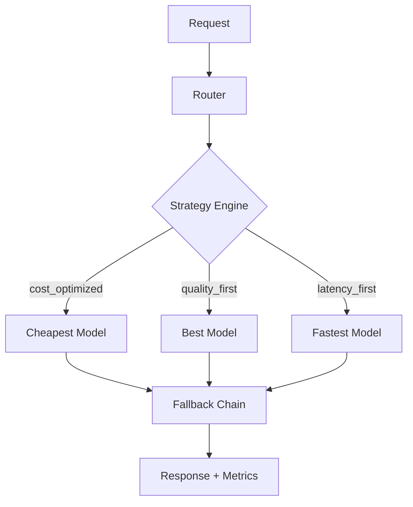

# 🔥 ModelMux

> Intelligent multi-model routing and fallback for LLM apps

[](https://github.com/MukundaKatta/ModelMux/actions)
[](LICENSE)
[]()

## What is ModelMux?
ModelMux routes LLM requests to the optimal model based on task complexity, cost budget, and latency requirements. It supports automatic fallback chains, load balancing, and cost tracking across multiple providers.

## ✨ Features
- ✅ Rule-based routing (task type, token count, cost budget)
- ✅ Automatic fallback chains on model failures
- ✅ Cost tracking per request and aggregate
- ✅ Latency-aware routing
- ✅ Support for OpenAI, Anthropic, and local models
- 🔜 Learned routing based on quality scores
- 🔜 A/B testing between models

## 🚀 Quick Start
```bash
pip install modelmux
```
```python
from modelmux import Router, ModelConfig

router = Router([
    ModelConfig(name="claude-sonnet", provider="anthropic", cost_per_1k=0.003, max_tokens=200000),
    ModelConfig(name="gpt-4o-mini", provider="openai", cost_per_1k=0.00015, max_tokens=128000),
])

response = router.route(
    prompt="Explain quantum computing",
    strategy="cost_optimized"
)
```

## 🏗️ Architecture


## 📖 Inspired By
Inspired by LiteLLM and Portkey's model gateway, but focused on intelligent routing rather than just API unification.

---
**Built by [Officethree Technologies](https://github.com/MukundaKatta)** | Made with ❤️ and AI
